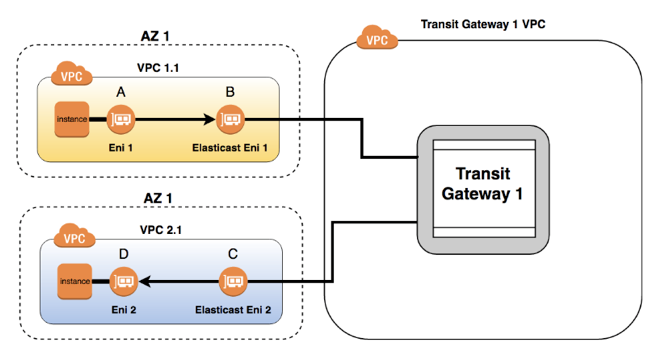
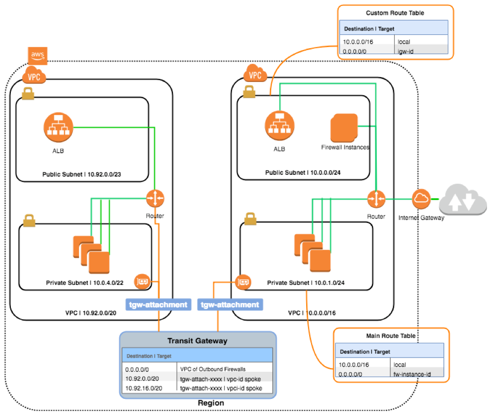
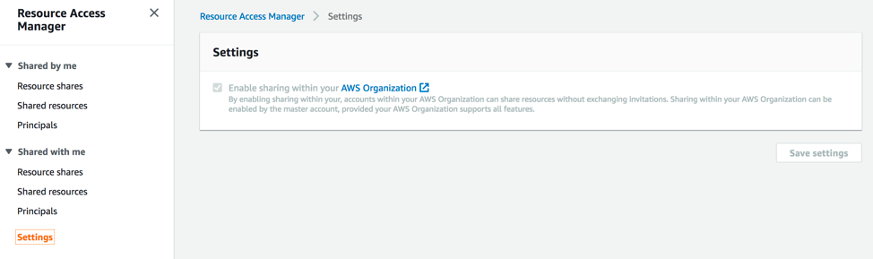
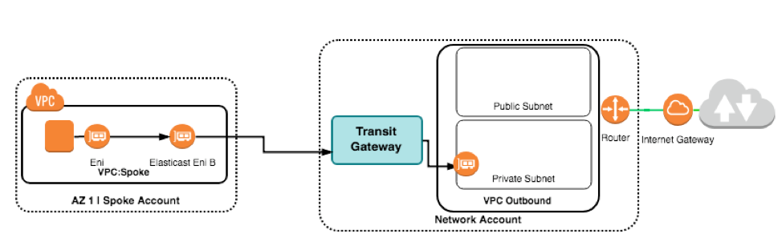
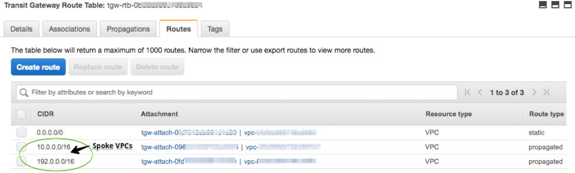
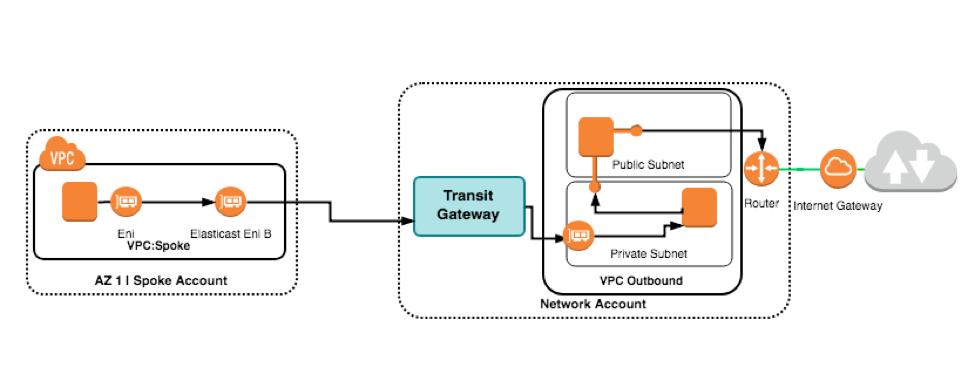
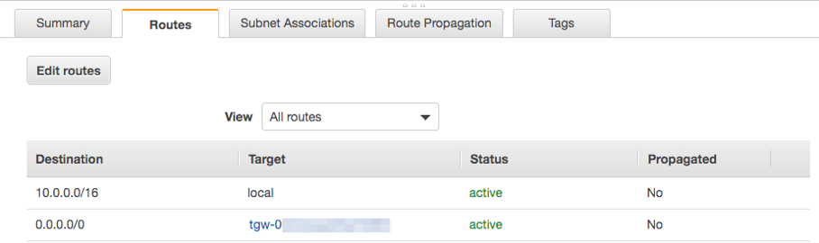

# AWS-Transit-Gateway-Multiple-Accounts-VPCs-with-Central-Outbound-Internet-Access


Historically it was common to deploy a hub-and-spoke network topology in a central VPC using 3rd party network services or direct point-to-point connections. The main reason behind this design is because transitive routing is not natively supported within AWS. What this means is that network traffic from one VPC cannot communicate to another VPC without a direct peering relationship. Peering is a non-transitive connection, meaning each VPC you want to connect too must be directly linked. As customers grow to meet their business needs more VPCs are created to service different lines of businesses and VPC-to-VPC connections start to increase.

As the management complexity grows with multiple accounts and multiple VPCs questions begin to arise. How do I manage all my VPCs in a consistent manner? Do I need to deploy 3rd party firewalls in every VPC to fulfill my organizational security requirements for Intrusion Prevention and Detection (IDS/IPS) services? Can I use a central VPC to control my egress points to the internet so I don’t have to procure and provision 3rd party services in every VPC?

In this blog post I’ll demonstrate how to deploy AWS Transit Gateway (TGW) to manage multiple VPCs across multiple accounts from a central location for all outbound internet communications. Please note I will not be deploying a 3rd party firewall product. Instead I will use an EC2 server to represent how most marketplace firewalls are configured within a VPC. 

How Does AWS Transit Gateway Help?
----------------------------------

As I previously mentioned, using multiple VPCs across multiple accounts becomes complex and the administrative burden naturally increases.  With the introduction of AWS Transit Gateway customers now have the ability to control how network routing and security is performed from a central location, granting the ability to scale workloads across a large number of VPCs and accounts and providing stronger operational controls with improved security.

Under the Hood Concepts for AWS Transit Gateways
------------------------------------------------

Basically, when we attach VPCs to the Transit Gateway, an elastic network interface (ENI) gets created for the chosen subnet. The ENIs are assigned a routable IP address from the subnet CIDR range and traffic can now be routable outside the VPC by updating the corresponding route tables.


 
Figure 1.0 - Gateway attachment between different VPCs

The Design
----------

The solution is designed to have a central AWS Transit Gateway service deployed in a central account to manage all the network communications from your on-premise data center and VPCs using a dedicated VPC to inspect outbound traffic to the internet. It will leverage AWS services such as AWS Organizations and AWS Resource Access Manager to address the complexities of using multiple accounts and will enable you to automatically provision VPC’s that integrate with a central TGW using AWS CloudFormation.

In the deployment walkthrough I will identify the steps involved to link all VPCs together through a TGW to a single outbound VPC. Note I will not be deploying a 3rd party network firewall with IDS/IPS capabilities in this post. Instead I will be using an EC2 server to represent the routing configurations for the solution work. You can choose your favorite marketplace IDS/IPS firewall product and follow the same steps to achieve the desired outcome.

Here is a simplified design reference of how traffic is routed through the TGW from one VPC to another VPC using EC2 instances.



Figure 1.1 – VPC routing configuration through a TGW

Deployment Walkthrough
-----------------------

Prerequisites

•	At least 2 or more AWS accounts
•	AWS Cli installed ([MacOS](https://docs.aws.amazon.com/cli/latest/userguide/install-macos.html), [Windows](https://docs.aws.amazon.com/cli/latest/userguide/install-windows.html))

For simplicity we will be configuring our VPCs with two subnets, public and private. Only the private subnets from each availability zone will communicate through the TGW.

Enable Trusted Access: AWS Resource Access Manager
--------------------------------------------------

The first step is enabling trusted access in AWS Organizations from the master account for AWS Resource Access Manager (details on master accounts can be found [here](https://docs.aws.amazon.com/organizations/latest/userguide/orgs_manage_accounts_create.html)).This is required to enable [trusted access](https://docs.aws.amazon.com/organizations/latest/userguide/orgs_integrate_services.html) to an AWS service to perform various tasks from member accounts. 

The first step is to enable automatic resource sharing for AWS Organizations from the master account: See the [user guide](https://docs.aws.amazon.com/ram/latest/userguide/getting-started-sharing.html#getting-started-sharing-orgs) for more details.

```
aws ram enable-sharing-with-aws-organization --region ca-central-1 --profile master
```


Figure 1.2 – Automatic resource sharing enabled


Deploy Transit Gateway
----------------------

In a multi-account setup, I recommend using a dedicated network account and VPC to centralize your network services. This is ideal in establishing administrative boundaries for network services such as firewalls, TGWs, DNS Resolvers and so on.

Create a file with the CloudFormation code below (edit the properties as you see fit):

```
AWSTemplateFormatVersion: 2010-09-09
Description: "TransitGateway: This template creates a network transit hub that interconnects attachments (VPCs and VPNs) within the same account or across accounts"
 
Resources:
  TransitGateway:
      Type: "AWS::EC2::TransitGateway"
      Properties:
        AmazonSideAsn: 64512
        AutoAcceptSharedAttachments: enable
        DefaultRouteTableAssociation: enable
        DefaultRouteTablePropagation: enable
        Description: Production Transit Gateway Coordinator
        DnsSupport: enable
        VpnEcmpSupport: enable
        Tags:
          - Key: Name
            Value: Prod Traffic Director
 
Outputs:
  MyStackName:
    Description: StackName
    Value: !Ref "AWS::StackName"
  TransitGateWayOutput:
    Description: The ID of the TransitGateway
    Value: !Ref TransitGateway
    Export:
      Name: !Sub ${AWS::StackName}-TransitGateway
```

Deploy the CloudFormation stack for the TGW in the network account:

```
aws cloudformation create-stack --stack-name tgw-tester --template-body file://transitgatewayV2.yml --profile def --region ca-central-1
```

Create A Resource Share: Transit Gateway
----------------------------------------

Once the Transit Gateway is deployed it can be shared across multiple accounts, the Organization or Organizational Unit. In this scenario we are sharing it across the entire Organization which was enabled from the master account.

```
aws ram create-resource-share --name TransitGateway --resource-arn arn:aws:ec2:ca-central-1:<account#>:transit-gateway/tgw-04d6xxxxxxxxxxx \
--principals arn:aws:organizations::<account#>:organization/<o-3xxxxxxx> \
--tags key=Name,value=Production-TGW \
--region ca-central-1
```

 
Create A Transit Gateway Attachment In a Spoke Account
------------------------------------------------------

Now that we created a Transit Gateway service and enabled automatic resource sharing with AWS Resource Access Manager we can create a VPC and Transit Gateway attachment in a spoke account. Note the Transit Gateway ID needs to be specified in the CloudFormation code for the Transit Gateway attachment to associate with.

Be sure to disable the internet gateway for the spoke VPC. Only the outbound VPC in the network account will contain an IGW.

[VPC and TGW CFN code](./vpc-tgw.yml)

Use the same CloudFormation code to deploy the second VPC to represent your outbound connectivity in your network account. The only difference is that you will enable an IGW for this deployment.

Essentially you would have the following resources deployed as indicated in Figure 1.3.


 
Figure 1.3 – Spoke account VPC with tgw attachment to network TGW and VPC

Limitation: Currently AWS::EC2::Route does not support transit gateway as a property so we cannot leverage CloudFormation to automatically update the route table in the private subnets. I have commented out the section in the code for when that feature is available but for now we will need to manually update the private subnet route tables in the VPCs to route traffic through the TGW.


Outbound Connectivity with a Central EC2 Instance
--------------------------------------------------

It is important to note that the configuration steps in the next section will specify the routing details required to route traffic from spoke VPC subnets into a centralized outbound VPC that would host a 3rd party firewall device for IDS/IPS security requirements and URL whitelisting. However, in this tutorial I will not be provisioning such a service but replicating the configuration steps with standard EC2 instances running as a [NAT instance](https://docs.aws.amazon.com/vpc/latest/userguide/VPC_NAT_Instance.html#NATInstance). The same steps would be identical if using a firewall product from the [AWS Marketplace](https://aws.amazon.com/marketplace).

Configuring the Instances
--------------------------

For simplicity we will focus on deploying just one EC2 instance to represent a centralized outbound egress point.

Steps
-----

1.	From the networking account create the nat instance and place it into the public subnet and associate an elastic IP address (EIP) . Note: Amazon Machine Image (ami) is specific to ca-central-1, please change the ami-id according to your region.
```
aws ec2 run-instances   --image-id ami-0b32354309da5bba5 --key-name MyKey --security-groups EC2SecurityGroup --instance-type t2.micro --placement AvailabilityZone=ca-central-1 --block-device-mappings DeviceName=/dev/sdh,Ebs={VolumeSize=50} --count 1
```
Create an EIP and associate it to the instance.

```
aws ec2 associate-address --instance-id i-0b26391xxxxxxxx --allocation-id eipalloc-64d58xxxx
```
2.	Disable source/destination check on the instance

```
aws ec2 modify-instance-attribute --no-source-dest-check --instance-id i-0b26391xxxxxxxx
```

3.	Create a static route in the TGW route table to the firewall VPC attachment
4.	Go back to the main/public route table and create a return route for each of the spoke CIDR ranges that will leverage the outbound VPC. For example 10.0.0.0/16 --> tgw-xxxxxxxxxx. Ensure that the firewall instances have a return route back to the TGW.



Figure 1.4 – Transit Gateway Route Table

The end result will resemble Figure 1.5 below.



Figure 1.5 – Spoke VPC to network VPC with a Firewall instance

Verify Outbound Connectivity Through The TGW
-------------------------------------------

From the spoke VPCs ensure the private subnet route table has a static route pointing to the tgw-attachment.



Figure 1.6 – Spoke VPC private route table

Launch an EC2 instance in the spoke VPC private subnet and test outbound connectivity. You can reference the AWS Regions and Endpoints services list to connect to Amazon services, try to install yum updates on your EC2 server or see if you can resolve [www.amazon.com](http://www.amazon.com/) from your spoke account private subnet.

Summary
-------

In this blog post I showed you how to create an AWS Transit Gateway in a central account and share it across your AWS Organization using AWS Resource Access Manager. The solution enabled a spoke account with no internet access to communicate through the TGW to an outbound VPC with internet access. I used an EC2 NAT instance to simulate the routing configuration and setup of a 3rd party marketplace firewall with IDS/IPS functionality. The key differences when you choose a firewall, or EC2 instance in this deployment is that it is your responsibility to ensure they are highly available across multiple availability zones so checking the health of the firewalls becomes very important. 
